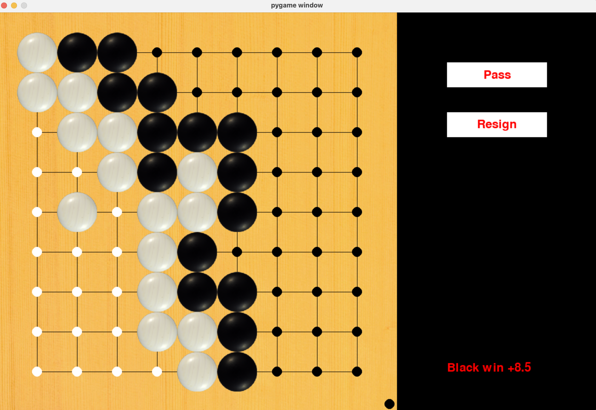

# Annotation

This project involves the development of a graphical user interface for the game of Go (Baduk). The board size is set at 9x9, with a komi value of 6.5, and it adheres to the Chinese rules. The interface is designed to support automatic score calculation.

## Screenshots

